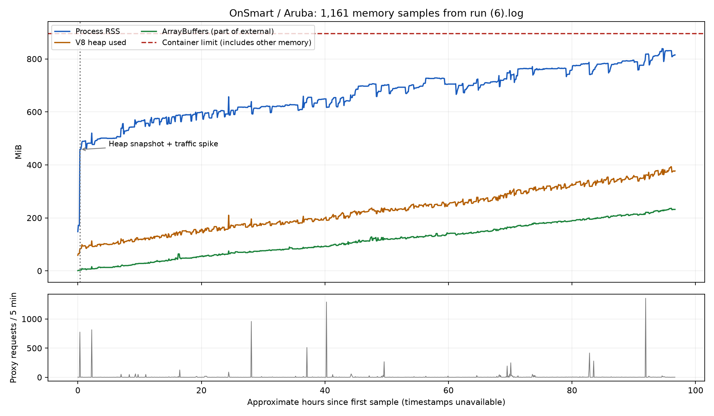

# OnSmart: аналіз зростання пам’яті на Aruba

Дата: 08.09.2026. Код: `93f68b6` із наявними локальними змінами. Джерело вимірів: наданий `run (6).log`, 183 954 байти. Журнал використаний як дані, а коментарі в коді про попередні причини — як гіпотези, що потребують перевірки.

**Основний висновок:** найсильніший кандидат — регресія Next.js 16.3 у завершенні `use cache` prerender. У встановленому Next.js 16.3.4 відсутнє очищення composite AbortSignal, яке upstream уже виправив у PR [#97476](https://github.com/vercel/next.js/pull/97476). Механізм утримання відтворено окремим локальним експериментом на встановленому React Flight і Node 24.13.0, зазначеному в Dockerfile. Це підтверджує дефект залежності, але ще не встановлює, яку частину пам’яті production утримує саме він. Для остаточної атрибуції потрібен retainer graph production heap або контрольний запуск виправленої збірки.

## Що показує журнал



Виділено **1 161** вимір, один старт Next.js, один записаний heap snapshot і **23** помилки Server Actions. Між першим і останнім виміром — приблизно **96,7 години**, якщо п’ятихвилинний інтервал не переривався. У рядках немає timestamps; точну тривалість і швидкість за календарним часом підтвердити неможливо. Код називає одиниці `MB`, але ділить на 1024²: фактично це **MiB**.

| Показник | Перший замір | Останній замір | Максимум |
|---|---:|---:|---:|
| RSS процесу | 148 | 815 | 839 |
| V8 heapUsed | 59 | 377 | 393 |
| V8 heapTotal | 64 | 401 | 411 |
| external | 4 | 236 | 240 |
| arrayBuffers | 1 | 232 | 236 |

`arrayBuffers` уже входить до `external`; `heapUsed` входить до `heapTotal`. Ці числа не можна додавати до RSS: це перекривні виміри. RSS процесу також не дорівнює використанню всього вузла Aruba. [Визначення Node.js](https://nodejs.org/docs/latest-v24.x/api/process.html#processmemoryusage).

Після відкидання перших приблизно 12 годин лінійна апроксимація дає:

- RSS: **+2,94 MiB/год**, R² = 0,957.
- heapUsed: **+2,91 MiB/год**, R² = 0,987.
- arrayBuffers: **+2,28 MiB/год**, R² = 0,995.

Це опис спостереженої кривої, а не прогноз часу падіння. Є звільнення частини пам’яті й локальні плато, але нижній рівень heap та буферів продовжує зростати. Теза «RSS збільшився, але це тільки зарезервований V8 простір» не пояснює одночасне зростання heapUsed і буферів протягом чотирьох діб. Строгу математичну необмеженість скінченний журнал не доводить.

**Початковий стрибок треба відокремити.** Перед знімком журнал повідомляє RSS 205 MiB, наступний регулярний замір — 458 MiB. У тому самому п’ятихвилинному вікні враховано 775 запитів, тому приписати всі +253 MiB виключно snapshot не можна. Саме створення snapshot потребує додаткової пам’яті та зупиняє головний потік, що підтверджує [документація Node.js](https://nodejs.org/learn/diagnostics/memory/using-heap-snapshot). Подальше зростання триває без наступних знімків.

Лічильник proxy сумарно зафіксував **10 033 запити**, 501 інтервал має `req/5m=0`. Це НЕ повний access log: matcher виключає, зокрема, `/_next/image`, static assets, robots і sitemap. Вихідних fetch зафіксовано: storage — **414**, Apify — **7**, Telegram — **22**. Відсутність fetch не виключає RSC/DB/кешування; `fetch/5m` рахує виклики, а не обсяг і час життя відповідей. Висновок у старих коментарях «нуль запитів ⇒ лише фонова причина» надто сильний.

## Чому головний підозрюваний — Next.js

| Стан | Дата | Next.js у package.json | Що це означає |
|---|---|---|---|
| `f767233`, admin feautch | 03.08 | `^16.2.10` | Аналітика адмінки вже є, переходу на 16.3 ще немає |
| `dea3929`, ncu | 05.08 | `^16.3.0` | Перехід у сімейство з описаною регресією |
| `c7e008c`, ncu | 17.08 | `^16.3.1` | Регресія залишається актуальною |
| `93f68b6` | 04.09 | `^16.3.4` | Саме 16.3.4 бачимо в журналі |

Між першими двома комітами змінювалися тільки package.json і lockfile. Отже, це сильна межа для експерименту із залежностями. За повідомленням власника атака була до оновлення 5 серпня: атака й початок саме цього витоку не повинні автоматично вважатися однією подією.

У `node_modules/next/dist/server/use-cache/use-cache-wrapper.js:845` створюється `AbortSignal.any()` з двох джерел. Після успішного `prerender()` у рядку 862 скасовується timer, але composite signal не завершується. Активний listener React може залишити signal і пов’язані об’єкти досяжними для GC.

Upstream описує цей дефект для production, Docker, `output: standalone`, `cacheComponents: true` і `use cache`; це збігається з архітектурою OnSmart. В issue [#97776](https://github.com/vercel/next.js/issues/97776) також описане утримання завершених HTTP requests і даних рендерингу. Це чужа діагностика, не heap-доказ для OnSmart.

PR [#97476](https://github.com/vercel/next.js/pull/97476) додає завершення вже створеного timeout controller після prerender, коли він входить до composite, із відокремленням cleanup від справжнього timeout. PR злитий у canary 19 серпня. **Злиття PR не означає його наявності в stable:** перевірена локальна 16.3.4 очищення не містить; її [release notes](https://github.com/vercel/next.js/releases/tag/v16.3.4) цього виправлення не заявляють.

Збільшення cloudlets не прибирає живих посилань на об’єкти. Зменшення `cacheMaxMemorySize` також не виправляє утримання поза LRU. В OnSmart ліміт уже 25 MiB, а `arrayBuffers` доходять до 236 MiB. Ліміт рахує певний кешований payload, не всю пам’ять framework; це не абсолютна межа фактичного RSS.

## Що перевірено експериментом

Скрипт [signal-probe.cjs](signal-probe.cjs) виконує два набори по 100 справжніх prerender через vendored experimental React Flight, який Next використовує з Cache Components. Він не запускає сайт, не підключається до DB, не надсилає HTTP/Telegram і не змінює node_modules.

| Варіант | Завершених prerender | Живих composite signals після GC | Abort listeners |
|---|---:|---:|---:|
| Поточна схема без очищення | 100 | 100 | 100 |
| Очищення за логікою upstream | 100 | 0 | 0 |

Результат повторений на **Node 24.13.0** і **24.20.0**, ОС Windows; встановлений Next — 16.3.4. Потоки обох наборів мають однаковий SHA-256, не лише однакову довжину. Збережені результати — `signal-probe-node24.13.json`, `signal-probe-node24.20.json`.

Обмеження експерименту: source controllers навмисно залишені досяжними в обох групах, щоб ізолювати різницю cleanup. Не відтворюється вся HTTP/PPR-послідовність OnSmart, не вимірюються Linux allocator/cgroup. Це перевірка конкретного механізму утримання, а не доказ повного усунення production-витоку.

Команда для наявного Node:

```powershell
node --expose-gc --conditions=react-server docs/reports/memory-2026-09-08/signal-probe.cjs
```

## Інші перевірені пояснення

| Кандидат | Факти в цьому проєкті | Оцінка |
|---|---|---|
| Звичайне наповнення кешу | Дві основні cache-системи мають бюджет; heap/буфери зростають майже лінійно протягом діб | Слабке пояснення всієї кривої |
| Sharp / glibc fragmentation | Docker використовує slim/glibc; є image optimization і 414 storage fetch | Може пояснювати частину RSS та піки, але не всю криву heapUsed + arrayBuffers |
| Аналітика адмінки | Локальні Map/Set усередині одного виклику; немає постійного накопичувача або polling у перевірених analytics-компонентах | Є ризик великих тимчасових виділень, доказу витоку не знайдено |
| SQL / mysql2 | Один pool через globalThis; limit 10 за замовчуванням, queueLimit 0 | Незавершені/повільні запити можуть утримувати чергу; потрібні runtime counts |
| Prepared statement cache | Типові Drizzle select у встановленому mysql2 adapter ідуть через `client.query`, не `client.execute` | Не можна приписувати всі catalog-запити кешу prepared statements |
| Telegram diagnostics | Dedupe Map обмежений 200 записами, частота обмежена, timeout 5 секунд; 22 fetch у журналі | Низький пріоритет як головної причини |
| Fetch host counters | Дві Map ростуть за унікальними host, не за запитами; у журналі лише 3 host | У цьому трафіку недостатньо для сотень MiB |
| Router filesystem LRU, issue #94890 | У встановленому коді вже є облік key + overhead і бюджет 8 MiB | Старе пояснення не слід автоматично переносити на 16.3.4 |
| Незавершені cache fills | `pendingSets`/читання stream живуть до завершення; LRU-бюджет не обмежує всі in-flight об’єкти | Наступний напрямок, якщо головна гіпотеза не підтвердиться |
| Clarity / Google Analytics / Recharts | Clarity/GA завантажуються в браузері; Recharts використовується UI адмінки | Новий Clarity не може пояснювати журнал 4–8 вересня, який передує його локальному додаванню |

Аналітика адмінки все ж має незалежну проблему масштабування: `getAdminAnalyticsOverview()` у `app/actions/admin/analytics/queries.ts:158` читає всі order_items, payments і products, навіть для короткого періоду, а потім фільтрує у JS. Це кандидат на SQL-агрегацію/фільтрацію окремим завданням. Така важка операція може посилювати наслідки framework-retention, але без retainer graph не можна стверджувати, що сама вона утримує результати після завершення.

Успішна відповідь Telegram не споживається в `lib/telegram-alert.ts:133`; це варто виправляти як акуратне завершення fetch response. Проте за наявних 22 викликів вона не є обґрунтованим поясненням сотень MiB. Кардинальність error keys обмежена; розмір рядка ключа окремо не обмежений.

## Атаки, помилки JSON і пакети

Усі 23 структуровані помилки мають `routeType: action`, POST, ID довжиною 42 та синтаксично коректний URL-decoded `next-router-state-tree`. Маршрути: `/catalogo` — 19, `/` — 3, `/chi-siamo` — 1. Стек веде до JSON.parse у React Flight decoder, а не до доведеної помилки JSON-файла бази.

Ці записи не підтверджують попередній сценарій `Next-Action: x` з пошкодженим router header. Водночас 42-символьний ID і звичайний User-Agent не доводять легітимність клієнта. Повного access log, тіла запитів і server-reference manifest саме production-збірки немає, тому походження цих POST і причина порожнього/обірваного JSON залишаються відкритими. Їх слід розслідувати окремо: до більшості помилок буфери вже довго зростали.

Перевірка переходів lockfile:

- `f767233 → dea3929`: 33 додані шляхи пакетів, 40 вилучених; переважно platform-пакети TypeScript 7 і дерево ESLint.
- `dea3929 → c7e008c`: 1 доданий шлях `better-call/node_modules/@better-auth/utils`, 2 вилучених.
- У цих lockfile не знайдено `resolved` URL поза `registry.npmjs.org`; серед нових записів немає `hasInstallScript`.
- Це структурна перевірка, не аудит усіх оновлених tarball і не форензика контейнера. Вона не виключає supply-chain compromise або виконання коду через іншу вразливість.

Поточний `npm audit --omit=dev` повернув **0 high, 0 critical і 5 moderate** записів, зокрема ланцюг esbuild/drizzle-kit та fflate. Результат збережено в [npm-audit.json](npm-audit.json). Аудит відомих advisory не є антивірусом; він також не доводить стан історично запущеного образу. Автоматичний `npm audit fix --force` не запускався.

## Як підтвердити й виправити без ризикованого перебору

1. **Ідентифікувати production-артефакт.** Зафіксувати image digest/commit, фактичні `node -v`, `require('next/package.json').version`, команду процесу та NODE_OPTIONS. `latest` — рухомий тег; локальний HEAD не є доказом точного вмісту запущеного контейнера. У workflow уже публікується тег commit SHA.
2. **Перевірити вже існуючий знімок.** У журналі є `/app/diagnostics/heap-2026-09-04T12-55-53-835Z.heapsnapshot`. Він ранній і не замінює порівняння з пізнішим. Шукати `gcPersistentSignals → AbortSignal → abort listener → React request/work-unit store` і завершені `ServerResponse`, `IncomingMessage`, `ArrayBuffer`/`Uint8Array`. Конструкторні підсумки `heap-summary.mjs` не показують утримувачів; слабкі/ephemeron-посилання треба трактувати за правилами GC, а не звичайним BFS.
3. **Контрольний тест на окремому середовищі.** Той самий application commit, Node/image base і конфіг; єдина відмінність — збірка Next з перевіреним backport PR #97476. Фікс має бути в артефакті, який реально виконує standalone, а не лише в одному вручну зміненому файлі node_modules. Для production краще перевірений stable/backport; довільне оновлення на latest canary одночасно внесе багато інших змін.
4. **Порівнювати 24–48 годин після прогрівання.** Включити звичайні GET, переходи RSC, Server Actions, повторне заповнення кешів після TTL, 404 і abort клієнта; без створення snapshot під час RSS-вимірів. Перевірити каталог, кошик, auth, admin; payment smoke-test — тільки sandbox провайдера. Критерій успіху: нижній рівень heap/буферів перестає стабільно рости, а кількість завершених утримуваних запитів не накопичується.
5. **Додати атрибуцію, якщо потрібна.** Timestamp, uptime і PID у кожен memory sample; cgroup current/max + anon/file; RSS усіх процесів; кількість активних HTTP requests, SQL queue/active connections та cache fills. Логувати route-клас, duration/status і кількість, не cookies, токени чи request bodies. Це дозволить розрізнити JS retention, native RSS, page cache та інші процеси вузла.
6. **Якщо backport не змінює криву:** порівняти retainer graph для in-flight cache streams, request AsyncLocalStorage, SQL queue/packet buffers та image pipeline. Для glibc/sharp провести окремий контрольований тест, не змінюючи одночасно Node, allocator, framework і кеші.

Snapshot на вузлі, який уже займає 828 із 896 MiB, може спричинити OOM. Краще використати існуючий файл або робити знімки в ізольованому середовищі з запасом пам’яті. Heap містить секрети та дані покупців; аналізувати локально, не завантажувати у публічні сервіси.

У репозиторії суперечливі вказівки щодо сигналу: route-коментар радить PID 1, а `.env.example` зазначає, що в керованому Aruba вузлі PID 1 — systemd. Не надсилати signal за неперевіреним PID. Крім того, `cd` у shell не змінює cwd уже запущеного Node: для signal snapshot треба перевірити cwd процесу або явно налаштувати diagnostic directory. Поточний HTTP endpoint сам вибирає каталог `/app/diagnostics`.

Окремо: Docker CMD зараз запускає migrations перед сервером. Тому «перевірити старий Docker-образ» не є гарантовано read-only операцією щодо DB. Для ізольованого A/B не запускати його проти production DB. У межах цього аналізу migrations, redeploy і перезапуски Aruba не виконувалися.

## Межі виконаної роботи й артефакти

Application-код, залежності та runtime-конфіг у цьому завданні не змінювалися. Попередні локальні зміни Clarity/ESLint та `get-all-products-filtered.ts` збережені. Додано лише цей звіт, числові результати, графік, відтворювані діагностичні скрипти й запис у to-do.

- [Числовий підсумок](summary.json), [усі memory samples](samples.json), [графік SVG](memory-trend.svg).
- [Парсер журналу](analyze-log.py): stdlib, matplotlib потрібен тільки для графіка; пакет для графіка встановлений у тимчасовий каталог, не в залежності магазину.
- [Локальний GC probe](signal-probe.cjs): точковий lint і перевірки assertions проходять.
- Загальні quality gates: див. [validation.json](validation.json). Наявні глобальні lint-помилки не приховувалися й не виправлялися шляхом рефакторингу магазину в рамках діагностики.

**Що ще невідомо:** фактичні NODE_OPTIONS/PID/image digest на Aruba; heap retainer graph процесу після зростання; розклад і маршрути трафіку; чи backport припиняє зростання саме OnSmart. До отримання цих доказів коректний статус — «конкретний дефект знайдено і відтворено; головна production-гіпотеза з високим пріоритетом», а не «витік у production вже усунуто».
